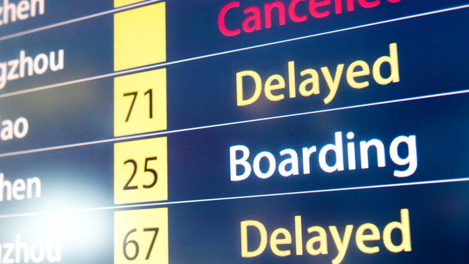
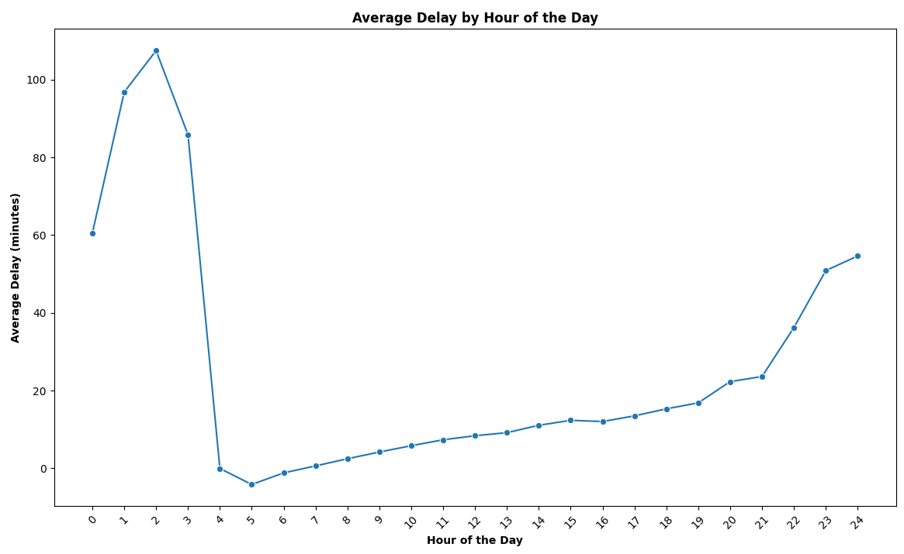
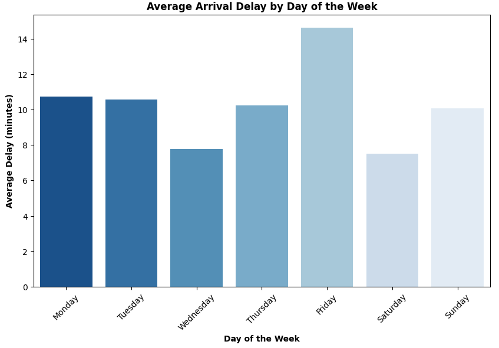
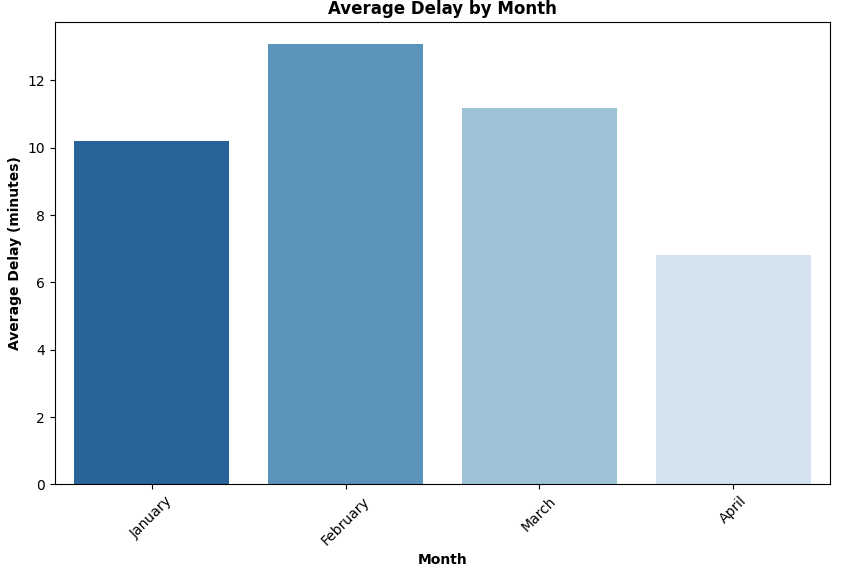
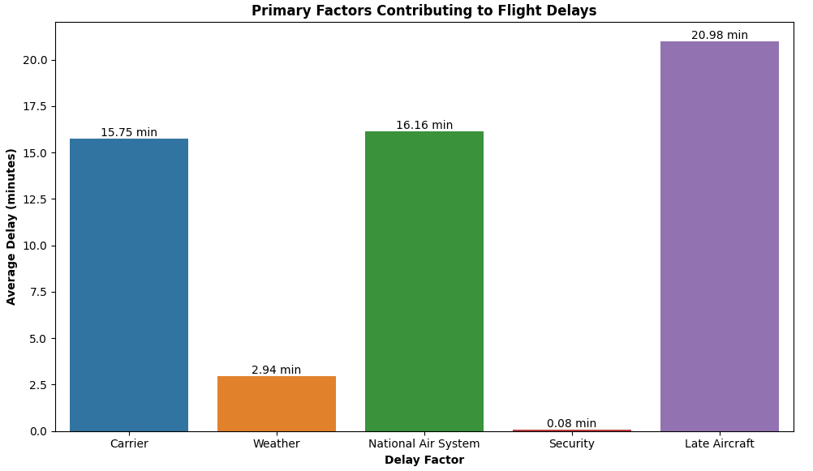
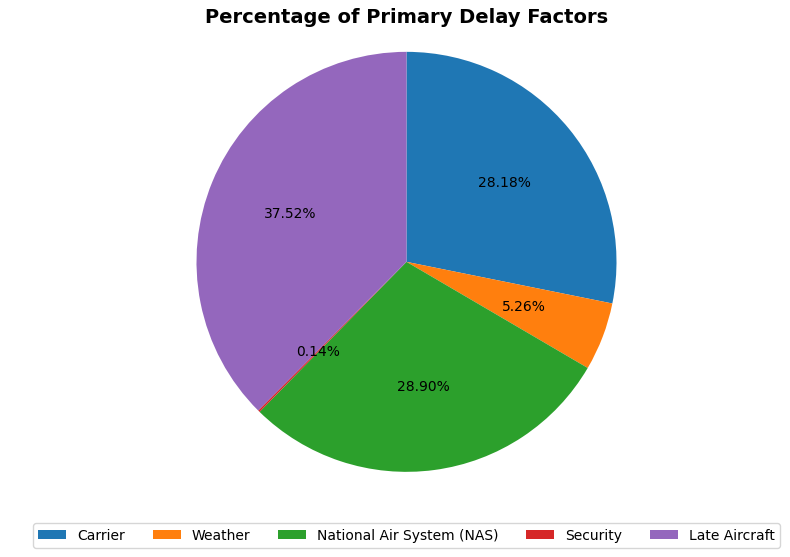
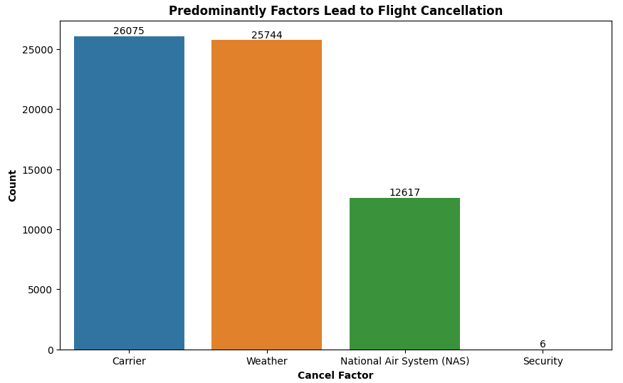
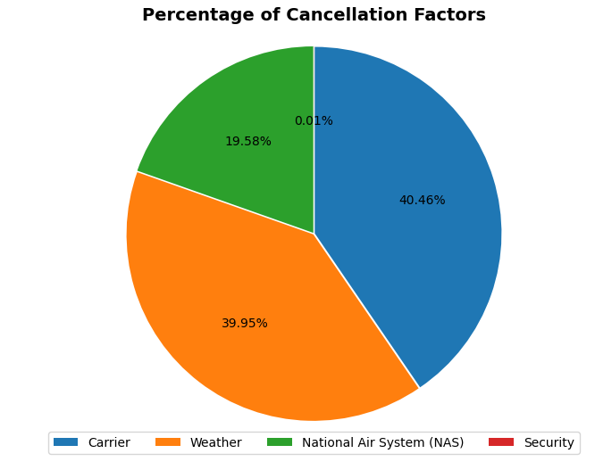
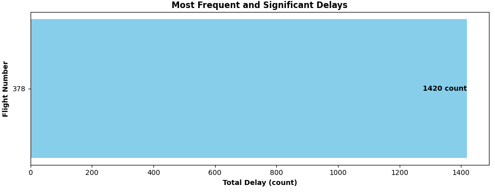
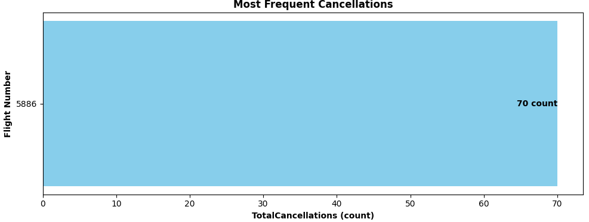

# <div align="center">ANALYSIS OF AIRLINES PERFORMANCES🛬</div>
## <div align="center">

## Introduction
This report provides an analysis of flight delays and cancellations for an airline. The goal is to understand the key factors causing these issues and suggest ways to improve. By examining various data points, we aim to provide clear insights and actionable recommendations to enhance flight punctuality and reliability. First, we cover the process of uploading a data file to HDFS, followed by analyzing the data using Pig, and finally, visualizing the results with Python packages.

## Problem Statement
Frequent flight delays and cancellations affect the airline's operations and passenger satisfaction. Identifying the primary reasons behind these disruptions and finding solutions to minimize them is crucial for improving service quality and operational efficiency.

## Objectives
1) Identify the main causes of flight delays and cancellations.

2) Determine the optimal times of the day, days of the week, and months of the year to minimize delays and cancellations.

3) Provide actionable recommendations to improve flight punctuality and reliability.

## Dataset 📖
The source of the data is from [Airline On Time Data](https://www.kaggle.com/datasets/wenxingdi/data-expo-2009-airline-on-time-data/data?select=1993.csv)
### **There are 4 main datasets that we will use:**
- 2008.csv 
- plane-data 
- carriers 
- airports

### **The main questions of interest in the dataset:**
- What are the optimal times of day, days of the week, and times of the year for minimizing flight delays?
- What are the primary factors contributing to flight delays?
- What factors predominantly lead to flight cancellations?
- Which flight experiences the most frequent and significant delays and cancellations?

We will answer all the questions using Pig

## Methodology 🪜
### **Uploading Datasets to Hadoop File System**

Here are the steps to upload the datasets (2008, plane-data, carriers, and airports) to the Hadoop File System:

**Step 1:** Transfer File to Virtual Machine

**Command Prompt:**
>

Explanation:

In this step, the pscp command (PuTTY Secure Copy) is used to transfer the 2008.csv file from the local Windows machine (specified by the user file path) to the home directory of the user maria_dev on the virtual local machine. The file is now accessible in the virtual machine but not yet in the Hadoop file system.

**Step 2:** Upload File to Hadoop File System

**Putty:**
>

Explanation:

Here, the hdfs dfs -put command is used to move the 2008.csv file from the local file system of the virtual machine (where it resides in /home/maria_dev/) to the Hadoop Distributed File System (HDFS). The file is uploaded to the directory /user/maria_dev/flight_data/ in HDFS, making it available for processing by Hadoop.

### **Learning Data Manipulation Using Pig**

### 1. **Data Loading:**
   
- Load datasets containing flight records, airport information, carrier details, and plane data into PIG.

```pig
------------------ Load all the file -------------

-- Load the flight record data
FLIGHT_RECORD = LOAD '/user/maria_dev/flight_data/2008.csv' 
USING PigStorage(',') 
AS (Year:int, Month:int, DayOfMonth:int, DayOfWeek:int, DepTime:int, 
    CRSDepTime:int, ArrTime:int, CRSArrTime:int, UniqueCarrier:chararray, 
    FlightNum:int, TailNum:chararray, ActualElapsedTime:int, 
    CRSElapsedTime:int, AirTime:int, ArrDelay:int, DepDelay:int, 
    Origin:chararray, Dest:chararray, Distance:int, TaxiIn:int, 
    TaxiOut:int, Cancelled:int, CancellationCode:chararray, 
    Diverted:int, CarrierDelay:int, WeatherDelay:int, 
    NASDelay:int, SecurityDelay:int, LateAircraftDelay:int);
--DUMP FLIGHT_RECORD

-- Load the airports data
AIRPORTS = LOAD '/user/maria_dev/flight_data/airports.csv' 
USING PigStorage(',') 
AS (iata:chararray, airport:chararray, city:chararray, state:chararray, country:chararray, lat:double, longitude:double);
--DUMP AIRPORTS;

-- Load the carriers data
CARRIERS = LOAD '/user/maria_dev/flight_data/carriers.csv' 
USING PigStorage(',') 
AS (Code:chararray, Description:chararray);
--DUMP CARRIERS;

-- Load the plane data
PLANES = LOAD '/user/maria_dev/flight_data/plane-data.csv' 
USING PigStorage(',') 
    AS (tailnum:chararray, type:chararray, manufacturer:chararray, 
    issue_date:chararray, model:chararray, status:chararray, 
    aircraft_type:chararray,engine_type:chararray,year:int);
--DUMP PLANES;
```

### 2. **Data Joining:**
```pig
-- Join FLIGHT_RECORD with AIRPORTS on Origin
FLIGHT_AIRPORTS_ORIGIN = JOIN FLIGHT_RECORD BY Origin LEFT, AIRPORTS BY iata;

-- Project the required fields
FLIGHT_AIRPORTS_ORIGIN_PROJECTED = FOREACH FLIGHT_AIRPORTS_ORIGIN GENERATE
    FLIGHT_RECORD::Year, FLIGHT_RECORD::Month, FLIGHT_RECORD::DayofMonth, FLIGHT_RECORD::DayOfWeek,
    FLIGHT_RECORD::DepTime, FLIGHT_RECORD::CRSDepTime, FLIGHT_RECORD::ArrTime, FLIGHT_RECORD::CRSArrTime,
    FLIGHT_RECORD::UniqueCarrier, FLIGHT_RECORD::FlightNum, FLIGHT_RECORD::TailNum, FLIGHT_RECORD::ActualElapsedTime,
    FLIGHT_RECORD::CRSElapsedTime, FLIGHT_RECORD::AirTime, FLIGHT_RECORD::ArrDelay, FLIGHT_RECORD::DepDelay,
    FLIGHT_RECORD::Origin, FLIGHT_RECORD::Dest, FLIGHT_RECORD::Distance, FLIGHT_RECORD::TaxiIn, FLIGHT_RECORD::TaxiOut,
    FLIGHT_RECORD::Cancelled, FLIGHT_RECORD::CancellationCode, FLIGHT_RECORD::Diverted, FLIGHT_RECORD::CarrierDelay,
    FLIGHT_RECORD::WeatherDelay, FLIGHT_RECORD::NASDelay, FLIGHT_RECORD::SecurityDelay, FLIGHT_RECORD::LateAircraftDelay,
    AIRPORTS::iata AS Origin_iata, AIRPORTS::airport AS Origin_airport, AIRPORTS::city AS Origin_city, AIRPORTS::state AS Origin_state,
    AIRPORTS::country AS Origin_country, AIRPORTS::lat AS Origin_lat, AIRPORTS::long AS Origin_long;

-- Join the result with AIRPORTS on Dest
FLIGHT_AIRPORTS = JOIN FLIGHT_AIRPORTS_ORIGIN_PROJECTED BY Dest LEFT, AIRPORTS BY iata;

-- Project the required fields
FLIGHT_AIRPORTS_PROJECTED = FOREACH FLIGHT_AIRPORTS GENERATE
    Year, Month, DayofMonth, DayOfWeek, DepTime, CRSDepTime, ArrTime, CRSArrTime, UniqueCarrier, FlightNum, TailNum,
    ActualElapsedTime, CRSElapsedTime, AirTime, ArrDelay, DepDelay, Origin, Dest, Distance, TaxiIn, TaxiOut, Cancelled,
    CancellationCode, Diverted, CarrierDelay, WeatherDelay, NASDelay, SecurityDelay, LateAircraftDelay, Origin_iata,
    Origin_airport, Origin_city, Origin_state, Origin_country, Origin_lat, Origin_long, AIRPORTS::iata AS Dest_iata,
    AIRPORTS::airport AS Dest_airport, AIRPORTS::city AS Dest_city, AIRPORTS::state AS Dest_state, AIRPORTS::country AS Dest_country,
    AIRPORTS::lat AS Dest_lat, AIRPORTS::long AS Dest_long;

-- Join the result with CARRIERS on UniqueCarrier
FLIGHT_AIRPORTS_CARRIERS = JOIN FLIGHT_AIRPORTS_PROJECTED BY UniqueCarrier LEFT, CARRIERS BY Code;

-- Project the required fields
FLIGHT_AIRPORTS_CARRIERS_PROJECTED = FOREACH FLIGHT_AIRPORTS_CARRIERS GENERATE
    Year, Month, DayofMonth, DayOfWeek, DepTime, CRSDepTime, ArrTime, CRSArrTime, UniqueCarrier, FlightNum, TailNum,
    ActualElapsedTime, CRSElapsedTime, AirTime, ArrDelay, DepDelay, Origin, Dest, Distance, TaxiIn, TaxiOut, Cancelled,
    CancellationCode, Diverted, CarrierDelay, WeatherDelay, NASDelay, SecurityDelay, LateAircraftDelay, Origin_iata,
    Origin_airport, Origin_city, Origin_state, Origin_country, Origin_lat, Origin_long, Dest_iata, Dest_airport,
    Dest_city, Dest_state, Dest_country, Dest_lat, Dest_long, CARRIERS::Code, CARRIERS::Description;

-- Join the result with PLANES on TailNum
FINAL_RESULT = JOIN FLIGHT_AIRPORTS_CARRIERS_PROJECTED BY TailNum LEFT, PLANES BY tailnum;

-- Project the required fields
FINAL_PROJECTED = FOREACH FINAL_RESULT GENERATE
    Year, Month, DayofMonth, DayOfWeek, DepTime, CRSDepTime, ArrTime, CRSArrTime, UniqueCarrier, FlightNum, TailNum,
    ActualElapsedTime, CRSElapsedTime, AirTime, ArrDelay, DepDelay, Origin, Dest, Distance, TaxiIn, TaxiOut, Cancelled,
    CancellationCode, Diverted, CarrierDelay, WeatherDelay, NASDelay, SecurityDelay, LateAircraftDelay, Origin_iata,
    Origin_airport, Origin_city, Origin_state, Origin_country, Origin_lat, Origin_long, Dest_iata, Dest_airport,
    Dest_city, Dest_state, Dest_country, Dest_lat, Dest_long, Code, Description, PLANES::tailnum, PLANES::type,
    PLANES::manufacturer, PLANES::issue_date, PLANES::model, PLANES::status, PLANES::aircraft_type, PLANES::engine_type, PLANES::year;
-- Store the final result
STORE FINAL_PROJECTED INTO '/user/maria_dev/flight_data/joined_data3' USING PigStorage(',');

```
### 3. **Data Analysis:**

**Load the Joined Data**
```pig
-- Load the joined data
DATA = LOAD '/user/maria_dev/flight_data/joined_data3' 
USING PigStorage(',') 
AS (Year:int, Month:int, DayofMonth:int, DayOfWeek:int, DepTime:int, 
    CRSDepTime:int, ArrTime:int, CRSArrTime:int, UniqueCarrier:chararray, 
    FlightNum:int, TailNum:chararray, ActualElapsedTime:int, 
    CRSElapsedTime:int, AirTime:int, ArrDelay:int, DepDelay:int, 
    Origin:chararray, Dest:chararray, Distance:int, TaxiIn:int, 
    TaxiOut:int, Cancelled:int, CancellationCode:chararray, 
    Diverted:int, CarrierDelay:int, WeatherDelay:int, 
    NASDelay:int, SecurityDelay:int, LateAircraftDelay:int,
    Origin_iata:chararray, Origin_airport:chararray, Origin_city:chararray,
    Origin_state:chararray, Origin_country:chararray, Origin_lat:double, Origin_long:double,
    Dest_iata:chararray, Dest_airport:chararray, Dest_city:chararray,
    Dest_state:chararray, Dest_country:chararray, Dest_lat:double, Dest_long:double,
    Code:chararray, Description:chararray,
    tailnum:chararray, type:chararray, manufacturer:chararray, 
    issue_date:chararray, model:chararray, status:chararray, 
    aircraft_type:chararray, engine_type:chararray, year:int);
```
  
**Q1. What are the optimal times of day, days of the week, and times of the year for minimizing flight delays?**

```pig
-- Extract hour from DepTime
DATA_WITH_HOUR = FOREACH DATA GENERATE *, (DepTime / 100) AS DepHour:int;

-- Group by DepHour and calculate average arrival delay
HOUR_DELAYS = GROUP DATA_WITH_HOUR BY DepHour;
AVG_HOUR_DELAYS = FOREACH HOUR_DELAYS GENERATE group AS DepHour, AVG(DATA_WITH_HOUR.ArrDelay) AS AvgArrDelay;
STORE AVG_HOUR_DELAYS INTO '/user/maria_dev/flight_data/results/hourly_delays' USING PigStorage(',');

-- Group by DayOfWeek and calculate average arrival delay
WEEKDAY_DELAYS = GROUP DATA BY DayOfWeek;
AVG_WEEKDAY_DELAYS = FOREACH WEEKDAY_DELAYS GENERATE group AS DayOfWeek, AVG(DATA.ArrDelay) AS AvgArrDelay;
STORE AVG_WEEKDAY_DELAYS INTO '/user/maria_dev/flight_data/results/weekday_delays' USING PigStorage(',');

-- Group by Month and calculate average arrival delay
MONTH_DELAYS = GROUP DATA BY Month;
AVG_MONTH_DELAYS = FOREACH MONTH_DELAYS GENERATE group AS Month, AVG(DATA.ArrDelay) AS AvgArrDelay;
STORE AVG_MONTH_DELAYS INTO '/user/maria_dev/flight_data/results/monthly_delays' USING PigStorage(',');
```

**Q2. What are the primary factors contributing to flight delays?**
```pig
-- Calculate average delay contributions for each factor
CARRIER_DELAY = FOREACH (GROUP DATA ALL) GENERATE AVG(DATA.CarrierDelay) AS CarrierDelay;
WEATHER_DELAY = FOREACH (GROUP DATA ALL) GENERATE AVG(DATA.WeatherDelay) AS WeatherDelay;
NAS_DELAY = FOREACH (GROUP DATA ALL) GENERATE AVG(DATA.NASDelay) AS NASDelay;
SECURITY_DELAY = FOREACH (GROUP DATA ALL) GENERATE AVG(DATA.SecurityDelay) AS SecurityDelay;
LATE_AIRCRAFT_DELAY = FOREACH (GROUP DATA ALL) GENERATE AVG(DATA.LateAircraftDelay) AS LateAircraftDelay;

-- Combine all delay factors into a single tuple
COMBINED_DELAYS = CROSS CARRIER_DELAY, WEATHER_DELAY, NAS_DELAY, SECURITY_DELAY, LATE_AIRCRAFT_DELAY;
FINAL_DELAYS = FOREACH COMBINED_DELAYS GENERATE
    CARRIER_DELAY.CarrierDelay AS CarrierDelay,
    WEATHER_DELAY.WeatherDelay AS WeatherDelay,
    NAS_DELAY.NASDelay AS NASDelay,
    SECURITY_DELAY.SecurityDelay AS SecurityDelay,
    LATE_AIRCRAFT_DELAY.LateAircraftDelay AS LateAircraftDelay;

STORE FINAL_DELAYS INTO '/user/maria_dev/flight_data/results/primary_delay_factors' USING PigStorage(',');
```

**Q3. What factors predominantly lead to flight cancellations?**
```pig
-- Filter out invalid cancellation codes
VALID_CANCELLATIONS = FILTER DATA BY (CancellationCode IS NOT NULL AND CancellationCode != '' AND CancellationCode != 'CancellationCode');

-- Group by CancellationCode and calculate the number of cancellations
CANCELLATIONS = GROUP VALID_CANCELLATIONS BY CancellationCode;
COUNT_CANCELLATIONS = FOREACH CANCELLATIONS GENERATE group AS CancellationCode, COUNT(VALID_CANCELLATIONS) AS Count;

STORE COUNT_CANCELLATIONS INTO '/user/maria_dev/flight_data/results/cancellation_factors' USING PigStorage(',');
```

**Q4. Which flight experiences the most frequent and significant delays and cancellations?**
```pig
-- Group by FlightNum and calculate total arrival delay
FLIGHT_DELAYS = GROUP DATA BY FlightNum;
TOTAL_FLIGHT_DELAYS = FOREACH FLIGHT_DELAYS GENERATE group AS FlightNum, SUM(DATA.ArrDelay) AS TotalArrDelay, COUNT(DATA) AS FlightCount;

-- Find the flight with the maximum total arrival delay
MAX_DELAY = ORDER TOTAL_FLIGHT_DELAYS BY TotalArrDelay DESC;
MOST_DELAYED_FLIGHT = LIMIT MAX_DELAY 1;
STORE MOST_DELAYED_FLIGHT INTO '/user/maria_dev/flight_data/results/most_delayed_flight' USING PigStorage(',');

-- Group by FlightNum and calculate total cancellations
FLIGHT_CANCELLATIONS = GROUP DATA BY FlightNum;
TOTAL_FLIGHT_CANCELLATIONS = FOREACH FLIGHT_CANCELLATIONS GENERATE group AS FlightNum, SUM(DATA.Cancelled) AS TotalCancellations;

-- Find the flight with the maximum total cancellations
MAX_CANCELLATIONS = ORDER TOTAL_FLIGHT_CANCELLATIONS BY TotalCancellations DESC;
MOST_CANCELLED_FLIGHT = LIMIT MAX_CANCELLATIONS 1;
STORE MOST_CANCELLED_FLIGHT INTO '/user/maria_dev/flight_data/results/most_cancelled_flight' USING PigStorage(',');
```
## Findings and Visualizations 📊

**Q1. What are the optimal times of day, days of the week, and times of the year for minimizing flight delays?**

**Optimal times of day for minimizing flight delays**
>
>
>**Insights:**
>
>**1. Early Morning Hours (3 AM - 8 AM):**
>
>- The lowest average delays occur between 3 AM and 8 AM, with the average delay dropping to nearly zero around 4 AM to 5 AM. This indicates that flights scheduled during these hours are the least likely to experience significant delays.
>  
>**2. Gradual Increase in Delays (9 AM - 8 PM):**
>
>- From 9 AM onwards, there is a gradual increase in average delays, reaching a steady rise around 3 PM to 8 PM. Although delays increase during these hours, they remain relatively moderate.
>  
>**3. Late Evening to Night (9 PM - 2 AM):**
>  
>- There is a significant increase in delays starting from 9 PM, peaking around midnight to 1 AM with average delays exceeding 100 minutes. Delays then gradually decrease again in the early morning hours.
>
>**Recommendations:**
>
>**1. Schedule Flights in Early Morning:**
>
>- To minimize the risk of delays, scheduling flights during the early morning hours (3 AM to 8 AM) is optimal. This period consistently shows the lowest average delays.
>  
>**2. Avoid Late Night Flights:**
>- Late night flights, particularly those scheduled around midnight to 1 AM, should be avoided if possible, as this period experiences the highest average delays.
>  
>**3. Monitor Midday to Evening Delays:**
>- While delays during midday to evening hours (9 AM to 8 PM) are not as high as late-night delays, they gradually increase. It's beneficial to monitor and manage operations carefully during these times to reduce potential delays.

**Optimal days of the week for minimizing flight delays**
>
>
>**Insights:**
>
>**1. Wednesday as the Optimal Day:**
>- Observation: Wednesday has the lowest average delay.
>- Implication: Flights on Wednesdays are the least likely to experience significant delays, suggesting operational stability.
>
>**2. Weekend Operations (Saturday and Sunday):**
>- Observation: Saturday and Sunday also exhibit relatively low average delays.
>- Implication: Weekend flights tend to face fewer delays, possibly due to lower traffic or more efficient scheduling.
>
>**3. High Delay Day (Friday):**
>- Observation: Friday has the highest average delay.
>- Implication: This day is prone to congestion and operational bottlenecks, leading to increased delays.
>
>**4. Moderate Delay Days (Monday, Tuesday, Thursday):**
>- Observation: Monday and Tuesday have similar delays, higher than Wednesday, Saturday, and Sunday, but lower than Friday. Thursday also shows moderate delays.
>- Implication: These days may be affected by cumulative delays from the beginning of the week or increased mid-week travel.
>
>**Recommendations:**
>
>**1. Optimizing Flight Schedules:**
>- Schedule a higher volume of flights on Wednesdays, Saturdays, and Sundays to leverage the lower delay trends.
>- Limit the number of flights on Fridays or allocate more buffer time between flights to accommodate potential delays.
>- Implement flexible scheduling that can adjust based on real-time data and historical delay patterns.
>
>**2. Collaboration with Airports and Authorities:**
>- Work closely with air traffic control and airport authorities to manage congestion and optimize flight paths, particularly on high-delay days.
>- Advocate for and invest in airport infrastructure improvements that can alleviate bottlenecks and enhance overall efficiency.
>
**Optimal times of the year for minimizing flight delays**
>
>
>**Insights:**
>
>**1. Lowest Delay Month (April):**
>- Observation: April has the lowest average delay.
>- Implication: Flights in April are the least likely to experience significant delays, suggesting this is the optimal month for minimizing delays.
>
>**2. High Delay Months (January, February, March):**
>- Observation: February has the highest average delay, followed by January and March.
>- Implication: These months are prone to higher delays, possibly due to weather conditions, increased travel demand, or operational challenges.
>
>**Recommendations:**
>
>**1. Schedule Optimization:**
>- Increase flight schedules and volume in April to leverage the lower delay trends.
>- Implement more conservative scheduling in January, February, and March to account for higher delay risks.
>- Allocate additional buffer time between flights in high delay months to absorb potential delays without affecting following flights.
>
>**2. Weather Preparedness:**
>- Invest in advanced weather prediction technologies, especially for the winter months (January, February), to anticipate and mitigate weather-related delays.
>- Develop and implement robust contingency plans for handling weather-related disruptions effectively.

**Q2. What are the primary factors contributing to flight delays?**
>
>
>
>**Insights:**
>
>**1. Late Aircraft is the Leading Cause:**
>- Aircraft delays are the main cause of both average and percentage delays. This implies that flights that arrive after their scheduled time seriously interfere with the schedule as a whole.
>
>**2. National Air System (NAS) and Carrier Related Delays:**
>- Both NAS and carrier-related issues contribute substantially to delays. This indicates that systemic issues within the air traffic control system and airline operations themselves are key areas of concern.
>
>**3. Weather and Security:**
>- Although security and weather are factors, their influence is much less than that of the other factors. Even though they happen less frequently, weather-related delays can be more unpredictable and challenging to handle.
>
>**Recommendations:**
>
>**1. Improve Turnaround Time for Aircraft:**
>- Airlines should focus on improving the effectiveness of their turnaround procedures in order to reduce aircraft delays. This could include more effective aircraft maintenance procedures, faster boarding procedures, and improved scheduling.

**Q3. What factors predominantly lead to flight cancellations?**
>
>
>
>**Insights:**
>
>**1. Carrier-Related Issues are the Leading Cause of Cancellations:**
>- Carrier-related problems are the most significant factor, contributing to 40.46% of cancellations. This includes issues like mechanical problems, crew availability, and operational difficulties.
>
>**2. Weather as a Major Contributor:**
>- Weather-related cancellations account for 39.95% of the total, indicating that adverse weather conditions are nearly as impactful as carrier-related issues in causing flight cancellations.
>
>**3. National Air System (NAS) Issues:**
>- NAS-related cancellations, making up 19.58% of the total, indicate that problems within the air traffic control system or national airspace infrastructure also play a notable role in flight cancellations.
>
>**4. Minimal Impact of Security Issues:**
>- Security issues contribute minimally to flight cancellations, representing only 0.01% of the total. This suggests that while security is crucial, it is not a primary factor in flight cancellations.
>
>**Recommendations:**
>
>**1. Improving Operational Strategy:**
>- In order to reduce cancellations caused by carriers, airlines should concentrate on strengthening their operational strategy. Improved crew management systems, stronger backup plans, and better maintenance schedules are a few examples of this.
>
>**2. Invest in Weather Prediction and Adaptation:**
>- To address weather-related cancellations, airlines can invest in advanced weather prediction technologies and develop flexible scheduling strategies that allow for rapid adaptation to changing weather conditions.

**Q4. Which flight experiences the most frequent and significant delays and cancellations?**

**Most Frequent and Significant Delays**
>
>
>**Insights:**
>
>- Flight number 378 has the most significant delays with a total count of 1420.
>- This flight is a critical concern and requires targeted attention to address and reduce the delays.
>
>**Recommendations:**
>- Conduct a comprehensive root cause analysis to identify the specific reasons behind the significant delays for flight number 378. Factors to investigate include operational issues, aircraft maintenance, crew scheduling, and external factors like weather and air traffic control delays.
>- Gather and analyze detailed data on each instance of delay for this flight to uncover patterns and common issues.

**Most Frequent Cancellations**
>
>
>**Insights:**
>
>- Flight with the most cancellation is flight number 5886 with 70 count of total cancellations.
>- This flight is experiencing frequent cancellations, indicating systemic issues that need to be addressed to improve reliability.
>
>**Recommendations:**
>- Conduct a comprehensive root cause analysis to identify the specific reasons behind the frequent cancellations for flight number 378. Examine factors such as operational constraints, aircraft availability, crew scheduling issues, and external influences like weather conditions.
>- Collect and analyze data on each cancellation instance to identify patterns and recurring issues that contribute to these cancellations.

## Conclusion

From the above findings, and after investigating and plotting, we deduced that:

The most significant factor contributing to flight delays is late aircraft, accounting for 37.52% of total delays, with an average delay of 20.98 minutes. Improving aircraft turnaround times and maintenance efficiency is necessary to address this issue. National Air System (NAS) issues are responsible for 28.90% of delays, averaging 16.16 minutes. Enhancing air traffic management and collaboration with air traffic control can help mitigate these delays.

Carrier issues are the leading cause of cancellations, accounting for 40.46% of total cancellations. Improving operational strategies and resource allocation can help mitigate these cancellations. Weather is responsible for 39.95% of cancellations. Advanced weather prediction and proactive planning are necessary to handle weather-related cancellations effectively.

The early morning hours (3 AM - 8 AM) have the lowest average delays, making them the optimal times for scheduling flights. Late night hours (9 PM - 2 AM) experience the highest delays and should be avoided for critical flights. Wednesday, Saturday, and Sunday have the lowest average delays, making them the best days of the week for scheduling flights. Friday has the highest delays and should be managed carefully. April has the lowest average delays, making it the optimal month for scheduling flights. February, January, and March have the highest delays, so scheduling fewer flights during these months can improve performance.

Flight 378 experiences the most significant delays, with 1420 counts. While Flight 5886 has the highest number of cancellations, with 70 counts. How to overcome this delays and cancellations? By addressing the underlying issues through root cause analysis, optimizing scheduling and improving maintanence and communicatuon are necessary.

By addressing these factors through targeted strategies, the airline can significantly reduce flight delays and cancellations, leading to improved operational performance, enhanced service quality and higher passenger satisfaction. Implementing these recommendations will help the airline maintain a competetive edge in the industry.

Pro tip 😉:
- If you want my advice on when to book your flight, the above charts and recommendations indicate that the early morning hours have the least delays throughout the day.

**If you are interested to know more or deeply on python coding for each graphs kindly go to Analysis_of_Airline_On_Time_Performance.ipynb.** 

### **Reference:**

Carlson, H. (2009, October 14). Data Expo 2009: Airline on-time performance analysis. Medium. https://carlson-hoo.medium.com/data-expo-2009-airline-on-time-performance-analysis-bb2e5bcf3042

# <div align="center">Enjoy 👍</div>

